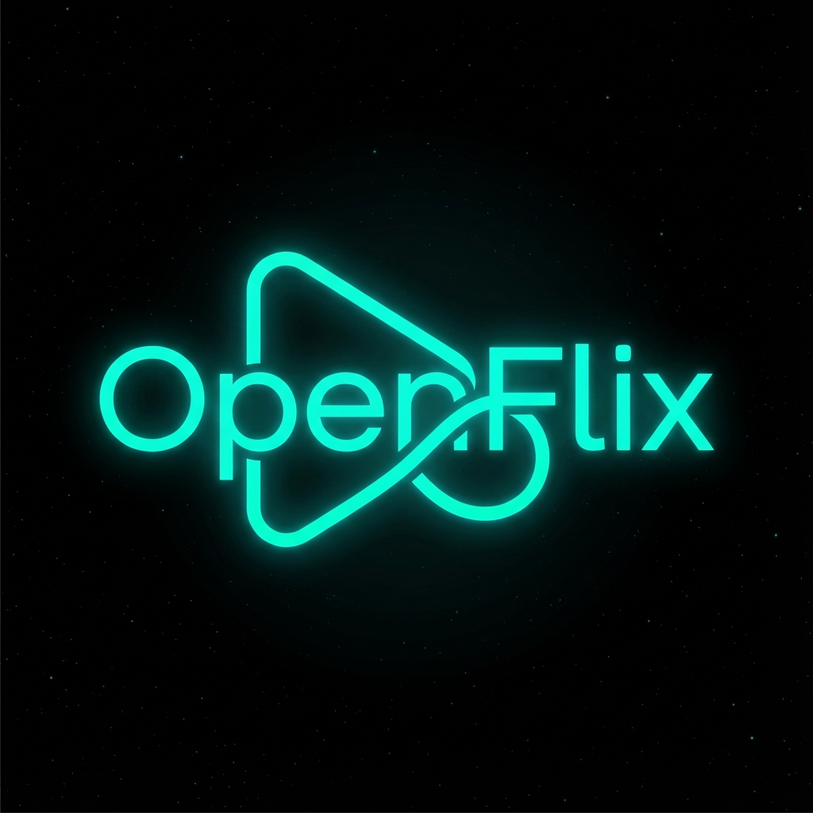

# OpenFlix 🎬

**OpenFlix** is a professional-grade, open-source streaming platform that allows users to discover and watch Movies, TV Shows, and Anime for free. Built with a modern tech stack and a premium "Deep Space" design system, it serves as a robust alternative to paid streaming services.



## 🚀 Features

### 🎨 Premium UI/UX
- **"Deep Space" Dark Theme**: A sophisticated immersive interface using deep blacks and neon teal/cyan accents.
- **Glassmorphism**: Modern frosted glass effects on sidebars and interactions.
- **Micro-Animations**: Smooth transitions, hover glows, and responsive feedback.
- **Responsiveness**: Fully optimized for Desktop, Tablet, and Mobile devices.

### 🎥 Smart Player
- **Multi-Server Support**: Includes 5 reliable embed sources (VidSrc Pro, Embed.su, VidSrc 2, 2Embed, Smashy) to ensuring playback never fails.
- **Secure Sandbox**: Custom security configuration to block malicious pop-ups and redirects while allowing playback.
- **TV Series Support**: Full Season and Episode selector for managing TV shows.
- **Deep Linking**: URL state management allows sharing exact movies or episodes (e.g., `?tv=123&s=1&e=1`).

### ⚡ Performance
- **Powered by Vite**: Blazing fast cold starts and HMR (Hot Module Replacement).
- **Lightweight**: Built with Vanilla JS (ES Modules) - no heavy frameworks.
- **TMDB Integration**: Fetches real-time data from The Movie Database for trending content and search.

## 🛠️ Tech Stack

- **Core**: HTML5, CSS3 (Variables + Flex/Grid), Vanilla JavaScript (ES6+).
- **Build Tool**: [Vite](https://vitejs.dev/).
- **API**: [TMDB API](https://www.themoviedb.org/documentation/api) for metadata.
- **Design**: Custom "Outfit" typography (Google Fonts) and bespoke CSS variables.

## 📦 Installation

To run OpenFlix locally:

1.  **Clone the repository:**
    ```bash
    git clone https://github.com/yourusername/openflix.git
    cd openflix
    ```

2.  **Install dependencies:**
    ```bash
    npm install
    ```

3.  **Start the development server:**
    ```bash
    npm run dev
    ```
    The app will be available at `http://localhost:5173`.

4.  **Build for production:**
    ```bash
    npm run build
    ```
    The output will be in the `dist` folder.

## 🛡️ Security Note

OpenFlix uses third-party embed providers (like VidSrc) for streaming content. While we implement a strict **iframe sandbox** to block malicious ads and pop-ups, we strongly recommend users install a browser ad-blocker (like **uBlock Origin**) for the safest experience.

## 🤝 Contributing

Contributions are welcome! Please feel free to submit a Pull Request.

1.  Fork the project.
2.  Create your feature branch (`git checkout -b feature/AmazingFeature`).
3.  Commit your changes (`git commit -m 'Add some AmazingFeature'`).
4.  Push to the branch (`git push origin feature/AmazingFeature`).
5.  Open a Pull Request.

## 📄 License

Distributed under the MIT License. See `LICENSE` for more information.
